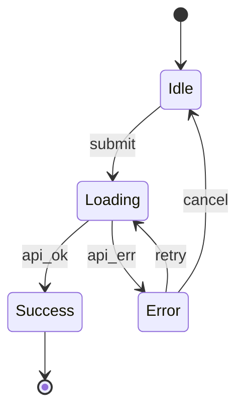

# Mermaid State Diagram Generator

## When to use
Use when the user wants a state machine/state transition diagram derived from code or specs, and the output must be Mermaid `stateDiagram-v2` plus an extraction summary.

## Inputs
- **Code**: UI state (useState/useReducer), state managers (Redux/Zustand/Recoil/Jotai), API handlers, jobs, enums + switch, workflow tables.
- **Specs**: PRDs, tickets, user flows, error handling, conversation logs.
- If scope is unclear, ask for the target feature or flow.

## Workflow
1. **Declare scope** in one sentence (what the state machine represents).
2. **Collect states** from enums, reducers, status variables, steps, routing branches.
3. **Collect transitions** (events), plus guards and actions/side effects.
4. **Normalize** synonyms, avoid flag explosion, split into main + substate/composite when needed.
5. **Build diagram** with initial/terminal states when applicable; include error/cancel/retry paths.
6. **Validate**: no unreachable states, no accidental dead-ends, add `[?]` to inferred transitions.

## Output (fixed)
### 1) Mermaid (code block)

### 2) Extraction summary (bullets)
- **Scope**: ...
- **States**: ...
- **Events**: ...
- **Guards**: ...
- **Actions/Side effects**: ...
- **Assumptions / Unknowns**: ... (explain each `[?]`)

## Rules
- **State definition**: a mode where behavior/UI is uniquely determined. Avoid raw flag lists.
- **Event definition**: user actions, API responses, timeouts, retries, disconnects.
- **Labels**: `event / guard` (guard optional). Keep state names short, CamelCase.
- **Uncertainty**: add `[?]` to inferred transitions and list them under assumptions.

## Advanced Mermaid syntax
If you need composite states, choice/fork/join, concurrency, direction, or comments, open `references/mermaid-stateDiagram.md`.

## Optional extras
When useful, add:
- **Test coverage ideas**: cases that traverse each transition at least once.
- **Forbidden transitions**: transitions that must not happen per spec.
